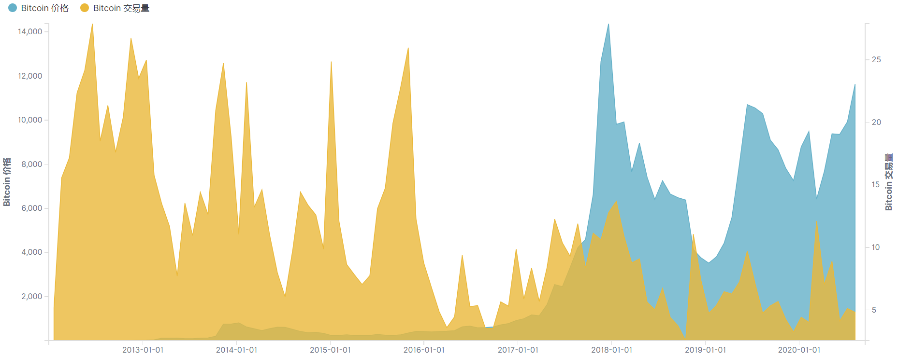
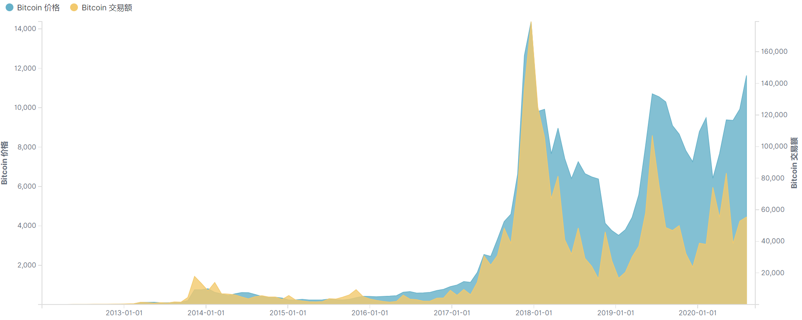
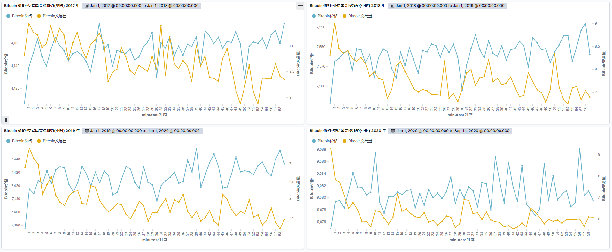
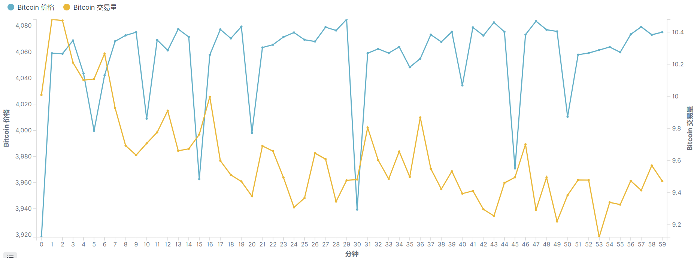
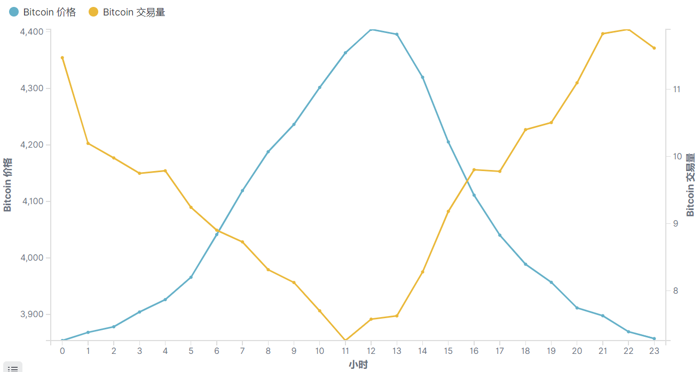
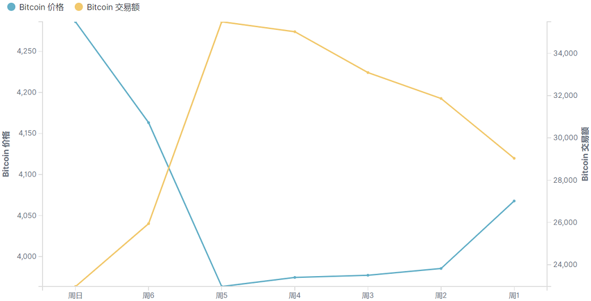
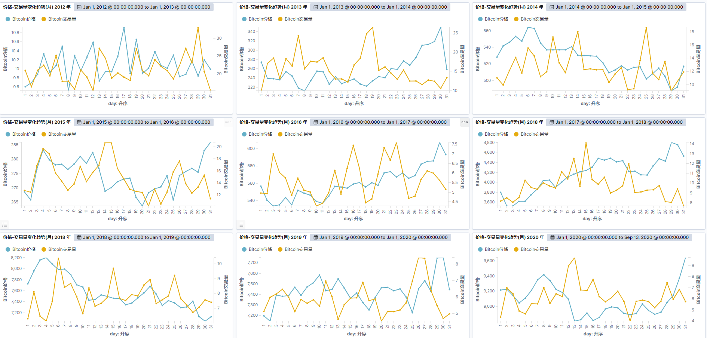
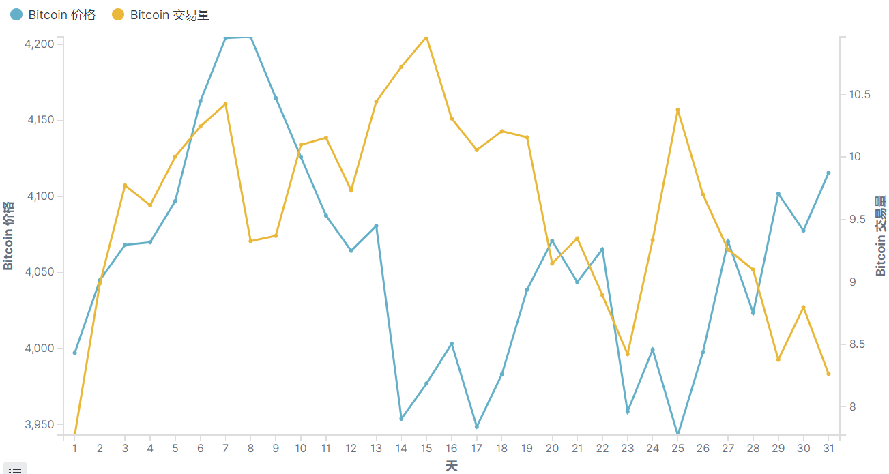

# BitcoinPrice 比特币大数据价格分析系统

## 1 项目背景

### 1.1 比特币简介

比特币（Bitcoin，缩写：BTC 或 XBT）是一种基于去中心化，采用点对点网络与共识主动性，开放源代码，以区块链作为底层技术的加密货币[6]，比特币由中本聪（Satoshi Nakamoto）于2008年10月31日发表论文[7]，2009年1月3日，创世区块诞生[^1]。

### 1.2 比特币的意义

中本聪在2008年于《比特币白皮书》[^2]中提出“区块链”概念，并在2009年创立了比特币网络，开发出第一个区块，即“创世区块”。比特币是应用区块链技术的第一款产品，从技术上验证了区块链技术的可行性，同时比特币以及其他加密数字货币的发展也推动了区块链技术的不断发展，今天区块链技术已经逐渐的融入了我们的生活中。

## 2 项目数据

### 2.1 数据来源

数据来源于数据建模和数据分析竞赛平台 [Kaggle](https://www.kaggle.com/) ，其专业领域从计算机科学到统计学、经济学和数学等。企业和研究者可在其上发布数据，统计学者和数据挖掘专家可在其上进行竞赛以产生最好的模型。[Kaggle](https://www.kaggle.com/) 的目标则是试图通过众包的形式来解决这一难题，进而使数据科学成为一场运动。2017年3月8日谷歌宣布收购Kaggle[^3]。

数据项目地址：https://www.kaggle.com/mczielinski/bitcoin-historical-data

### 2.2 数据集基本情况

数据集概况

|              |          说明           |           备注           |
| :----------: | :---------------------: | :----------------------: |
| 原始数据大小 |        287177 KB        |                          |
|  原始数据量  |         4572257         |        存在空数据        |
|  有效数据量  |         3330541         |                          |
| 数据时间范围 | 2012-01-01 ~ 2020-09-04 | 某些时间段数据丢失或为空 |
| 数据时间精度 |          分钟           |                          |


**数据集字段**

|       字段        | 字段类型 |   字段示例   |      字段说明      |
| :---------------: | :------: | :----------: | :----------------: |
|     Timestamp     |   Long   |  1600041600  | Unix 时间戳（秒）  |
|       Open        |  Double  |   10338.82   |   开盘价（美元）   |
|       High        |  Double  |   10338.82   |   最高价（美元）   |
|        Low        |  Double  |   10332.37   |   最低价（美元）   |
|       Close       |  Double  |   10332.37   |   收盘价（美元）   |
|   Volume_(BTC)    |  Double  |  1.29200642  |   每分钟总交易量   |
| Volume_(Currency) |  Double  | 13349.565122 |  每分钟总交易金额  |
|  Weighted_Price   |  Double  | 10332.429402 | 每分钟权重交易价格 |

> $Volume\_(Currency) = Volume\_(BTC) * Weighted\_Price$


**数据示例**

有效数据实例：

```
1600041420,10331.41,10331.97,10326.68,10331.97,0.57281717,5918.0287407,10331.444396
1600041480,10327.2,10331.47,10321.33,10331.47,2.48990915,25711.238323,10326.175283
1600041540,10330.02,10334.78,10328.64,10334.78,4.57266041,47253.747619,10333.972651
1600041600,10338.82,10338.82,10332.37,10332.37,1.29200642,13349.565122,10332.429402
```

无效数据示例：

```
1380908040,NaN,NaN,NaN,NaN,NaN,NaN,NaN
1380908100,NaN,NaN,NaN,NaN,NaN,NaN,NaN
1380908160,NaN,NaN,NaN,NaN,NaN,NaN,NaN
```


**OHLC值的说明**

由于原始数据中的OHLC(开盘价、最高价、最低价、收盘价)存在明显问题（开盘价短时间内存在变化，与数据的意义不相符，其他用户也提出相关问题[^4]），所以在本项目中不适用这 4 个指标进行分析。

```
1510958700,7772.22,7775,7772.22,7775,2.02612938,15753.110545,7774.9776006
1510958760,7775,7775,7762.12,7775,4.15999523,32323.859547,7770.1674545
1510958820,7769.99,7770,7769.99,7770,0.63395811,4925.8525147,7769.9968452
1510958880,7770,7770,7749.1,7750,18.46858942,143211.93337,7754.3514621
1510958940,7750,7750,7740,7749.99,2.45365995,19002.218811,7744.4385931
1510959000,7748.99,7749.99,7734.18,7743.85,2.22465782,17222.72704,7741.7420714
1510959060,7743.85,7765,7739.43,7760,45.82818531,354938.88659,7744.9910832
1510959120,7745.8,7750,7745.8,7750,5.6973563,44154.26008,7749.9559014
1510959180,7750,7750,7742.4,7750,29.70705311,230184.46741,7748.4786713
```


<center>图 1 数据集错误说明</center>

### 2.3 数据集时区

数据中的时间均使用 CTS 格式化，及**使用 00 时区**


## 3 项目具体

### 3.1 项目概况

本项目旨在利用此数据实现两方面的研究，统计分析和实时分析。统计分析旨在研究在不同时间尺度下 Bitcoin 的交易量，交易价格以及交易金额的变化以及他们的内在联系。实时分析则通过 Flink 实现实时价格变化分析、计算和预警。

> 由于篇幅和显示效果的原因本文档只展示项目的部分结果，主要是可视化成果，对于实时计算分析部分和价格预测部分只做简要的介绍。

### 3.2 软件平台

**数据处理、可视化及实时计算部分**

|     软件      |                   版本                    |                作用                |
| :-----------: | :---------------------------------------: | :--------------------------------: |
|     Java      | Oracle JDK 1.8.0.-271 / Oracle JDK 11.0.9 |         所有框架的底层服务         |
|     Scala     |                  2.12.12                  | 本项目主要是Flink的Scala API来实现 |
|     Flink     |            Apache Flink 1.11.2            |           数据清洗和计算           |
|     Kafka     |            Apache Kafka 2.4.1             |              数据通道              |
|     Redis     |                   5.0.5                   |          提供快速读取服务          |
|   Zookeeper   |               Apache 3.5.7                |           管理Kafka集群            |
|    Hadoop     |            Apache Hadoop 3.1.3            |           提供分布式存储           |
|     MySQL     |                  5.7.30                   |            提供数据存储            |
| Elasticsearch |                   7.8.0                   |       提供快速分布式查询服务       |
|    Kibana     |                   7.8.0                   |    在ES查询基础上提供数据可视化    |

**价格预测模型部分**

|    软件    | 版本  |  备注   |
| :--------: | :---: | :-----: |
|   python   |  3.7  |         |
|    CUDA    | 10.1  |         |
|   cuDNN    | 7.6.5 |         |
| TensorFlow | 2.1.0 | GPU支持 |
|  PyTorch   | 1.6.0 | GPU支持 |

> 价格预测只完成预研，目前已经完成模型选择和数据维度扩展工作。

### 3.3 数据集清洗

1. 首先清洗掉数据集中的无效数据，最终得到有效数据 **3330541** 条
2. 由于数据集中的 **OHLC**  4个值存在部分错误，因此删除这部分字段不再使用

## 4 统计分析

#### 4.1 价格-交易量历史变化趋势



<center>图 2 价格-交易量历史变化趋势</center>

#### 4.2 价格-交易额历史变化趋势



<center>图 3 价格-交易额历史变化趋势</center>

## 5 价格-交易量一小时内变化趋势

图 4 依次为 2017、2018、2019以及2020年(截至9月14日)，Bitcoin交易量与交易价格在不同**分钟刻度**的变化趋势，反映的是在一小时内不同时刻的价格-交易的变化趋势。由于排版方面的限制只绘制了最近4年的结果。



<center>图 4 不同年度一小时内价格-交易量变化趋势</center>

图 5 是所有数据交易量-交易价格在不同**分钟刻度**的变化趋势。



<center>图 5 全部数据一小时内价格-交易量变化趋势</center>

#### 5.1 数据可信度分析

图 4 中每个点都是 8640 个数值的平均值 ($12 * 30 * 24$，每月按 30 天算) ，数据量接近 $10^4$ ，故统计结果具有一定的可信度。

#### 5.2 交易量变化分析

1.  2017年每分钟交易量平均值约等于 9.7 BTC ，2018年是 8.0 BTC ，2019年是 5.8 BTC，2020年是 6.0 BTC。结合 Bitcoin 的计算规则，计算一个 Bitcoin 的算力在一段时间后会翻一倍，交易量逐渐减小符合预期。 
2. 从四幅图像中可以看出整点 (00，01) 的交易量最高，随后会出现 $10\%$ 左右的下滑，说明交易更多发生在诸如 08:00、14:00 的整点时间进行交易。这个数据也符合**整点发币**的交易惯例，使用**整点发币**规则可以一定程度上降低手续费。
3. 从四幅图像的波动趋势来看，除整点附件外每分钟交易量正在趋同，如图中 2017 和 2018 年的波动情况都明显比 2019 年和 2020 年剧烈，但是另外一方面**整点发币**正愈发明显。
4.  从 2019 年和 2020 年的数据来看，除整点之外交易量正逐渐趋同，但其中每隔 15 分钟左右会出现一次交易小高峰，在 2020 的数据上尤其明显。

#### 5.3 价格变化分析

1. 从 4 幅图像可以看出，最低的价格出现在 00 时刻，随后在在 01 时刻又快速上涨。
2. 2017年、2018年、2019年的次低价格通常出现在 30 时刻，但是在 2020 年此规则不在成立。 

#### 5.4 价格-交易量变化分析

1. 受到**整点发币**的交易惯例的影响，整点的交易最高，此时价格也是最低值，由此可以推测瞬间增长的交易量将造成交易价格的下降。
2. **追涨杀跌**情况较为明显，若当前价格相比前一分钟出现上涨，那么在下一个分钟，交易量将会出现一定程度的下跌，同理当前价格相比前一分钟出现下跌，那么在下一分钟，交易量将会出现上涨，抛售明显。
3. 由于2018年和2019年中Bitcoin的价格相比2017年和2020年比较平稳，没有出现2017年12月和2020年下半年的大涨情况，数据中**追涨杀跌**情况较为明显，尤其是2019年中，两个量的增长趋势几乎是对称的。


## 6 价格-交易量一天内变化趋势

图 6 是 2012 - 2020(截至9月14日) 每个自然年中 Bitcoin 价格与交易在一天中的变化趋势，表示的是比特币价格-交易量在在一个自然日的不同小时刻度的价格变化趋势，从中可以得到比特币在一天中的价格及交易量走势。图 7 是所有数据中 Bitcoin 价格与交易在一天中的变化趋势。

#### 6.1 数据可信度分析

图 6 中每个点都是 21600 个数值的平均值 ($12 * 30 * 60$，每月按 30 天算) ，数据量超过 $10^4$ ，故统计结果具有一定的可信度。

#### 6.2 时间说明

**时区**

图 6 中采用的 CTS 时间，既 00 时区，如果是北京时间需要增加 8 小时，纽约时间需要减去 5 小时，洛杉矶时间需要减去 8 小时。下文中 0 点表示的 00 时区的 0 点，对于特定的时区将表明，如北京时间 18 点。

**时间划分**

图 6 中小时表示的真实时间的小时部分，如 23:45 在图中就是 23，同理 12:36 就是12


<center>图 6 不同年度一天内价格-交易量变化趋势</center>



<center>图 7 全部数据一天内价格-交易量变化趋势</center>

#### 6.3 交易量变化分析

1. 从 2012 年的变化趋势可以看出早期 Bitcoin 交易在一天中基本是平均分布的，可以推测此时 Bitcoin 主要玩家是技术极客，他们分布于世界各地不同的时区，所以造成一天中交易量比较均衡。

2. 从 2017 年开始，Bitcoin的交易在一天中呈现出一定的规律，在 22 - 00 达到交易高峰，随后逐渐下跌到 12 左右达到一天中的最低值。

3. 根据 Bitcoin 的基本情况知道，从 2017 年价格疯涨开始，大量中国玩家进入这个领域，成为职业挖矿人，也有大部人成为职业炒币玩家，整个中国的算力占比超过一半，因此一天中的交易走势也于中国玩家的作息有关。

   - 2018 ~2020 的 3 年中 04:00 ~ 05:59 间交易量均先增长后下跌，此时正是北京时间 12:00 ~ 13:59 之间，此时中国玩家完成上午最后的交易，享受午饭时光然后大半个中国都处于睡梦中，同时此时也是美国中部时间 22:00 ~ 23:59之间，此时美国本土玩家也完成当日最后的交易进入梦乡。
   - 2018 ~2020 的 3 年中全天最低的交易量均出现在  10:00  ~ 11:59 之间此时正是北京时间 18:00 ~ 19:59 之间，整个东亚进入晚餐时间，同时此时也正是美国的凌晨玩家正在早已进入梦乡。


#### 6.4 价格变化分析

1. 从整个图像看出，Bitcoin的价格在一天中有明显的走势，基本符合先增长后下跌的趋势，01点左右为全天最低值随后开始增长在 12 点左右达到全天的最高值然后又开始下跌。
2. 由于数据不去以及价格疯涨使得2020年的出现了一些变化，但是其整体依旧符合先增长后下跌的趋势只是全天的最高值出现在了 5 点，最低值出现在了 19 点，相当于图像发生了平移。
3. 由于一天中的价格又明显的趋势，因此对于炒币玩家来说，有明确的买入时间
4. 通过计算一天中最高值大约比最低值高 $1\%$

#### 6.5 价格-交易量变化分析

1.  同分钟尺度的分析结论一样，价格和交易量之间是负相关，交易量最低的时候往往就接近价格最高的时候
2.  可以猜测 Bitcoin 在一天中走势主要是受到交易走势的影响，当交易量增长的时候价格会出现一定程度的下跌，反之亦然


## 7 交易量-价格一周内变化趋势

图 8  是 2012 - 2020中 每年 Bitcoin 价格与交易在一周中的变化趋势，表示的是比特币价格-交易量在在一周中不同不同自然日的价格变化趋势。图 9 是所有数据中 Bitcoin 价格与交易在一周中的变化趋势。

#### 7.1 数据可信度分析

图 8 中每个点 74057 左右个数值的平均值 ($12 * 30 * 60 * 24  /  7$，每月按 30 天算) ，数据量解决 $10^5$ ，故统计结果具有一定的可信度。


<center>图 8 不同年度一周内价格-交易量变化趋势</center>



<center>图 9 全部数据一周内价格-交易量变化趋势</center>

#### 7.2 交易量变化分析

1. 很明显无论是哪一年，交易量基本都是先从周一开始增加在周四周五两天达到最大值，然后开始迅速下跌在周天达到一周交易的最低值 ，很明显这个与人们的工作作息严格相符。
2. 2018年和2019 年的变化趋势，基本相同说明 Bitcoin 的交易早已成熟，玩家在一周中拥有较为固定的交易习惯。

#### 7.3 价格变化分析

1. 2018年和2019年的价格变化趋势基本相同，同时从周一开始持续下跌到周五达到一周中的最低值，然后又开始上涨。
2. 对于 2017 年，其全年总 Bitcoin 的价格几乎都在上涨，所以一周的价格走势基本都是上涨，因为整体来说当天的价格总是比前一天高，后一天低。
3. 可以预测，同 2017 年一样整个 2020 年Bitcoin的价格的整体趋势是不断上涨切涨幅超 $150\%$ ，因此其在一周的价格走势也是相似及不断上涨

#### 7.4 价格-交易量变化分析

1. 通过全部数据的变化趋势来看，正常情况下一周内的价格-交易量走势，基本就是 2018年和2019年相同变化趋势，交易从周一开始先增加到周五达到最大值然后开始迅速减少在周天达到最低，而交易价格基本和交易量是相反的走势，这也符合市场的规律。
2. 同样在 2017 也基本符合此起彼伏的趋势，及价格上涨交易量就下跌，价格下跌交易量上涨，符合市场规律

## 8 交易量-价格一月内变化趋势

图 10 是 2012 - 2020中 每年 Bitcoin 价格与交易在一月中的变化趋势，表示的是比特币价格-交易量在在一个自然月中的不同自然日的价格变化趋势图 11 是所有数据中 Bitcoin 价格与交易在一月中的变化趋势。

#### 8.1 数据可信度分析

图中每个点都是 17280 个数值的平均值 ($12 * 24 * 60$) ，数据量超过 $10^4$ ，故统计结果具有一定的可信度。




<center>图 10 不同年度一月内价格-交易量变化趋势</center>



<center>图 11 全部数据一月内价格-交易量变化趋势</center>

#### 8.2 交易量变化分析

1. 交易量变化比较随机，没有显现出明显的变化趋势，且不同年度之间的差异较大

#### 8.3 价格变化分析

1. 价格的变化同样比较随机，受到一段时候快速上涨的影响较大。

#### 8.4 价格-交易量变化分析

1. 价格交易量之间同样没有明显的变化趋势，需要进一步挖掘。


## 9 实时分析

#### 9.1 阈值报警

当价格、交易量和交易金额中的一个或多个达到阈值就触发报警。

#### 9.2 变化报警

当价格、交易量和交易金额中的一个或多个相对于之前的一个或多个状态的变化量超过阈值就触发报警。

可以借助 RichFlatMapFunction  来实现，以下为价格变化超过 threshold 的简要代码：

```scala
class priceChangAlert(threshold: Double) extends RichFlatMapFunction[in, out] {
    // 定义状态存储上一个值，如果需要存储多个值使用 ListState 或 MapState
    lazy val lastPriceState: ValueState[Double] =
    getRuntimeContext.getState(new ValueStateDescriptor[Double]("last-price", classOf[Double]))

    override def flatMap(value: in, out: Collector[out]): Unit = {
        val lastPrice: Double = lastPriceState.value()
        val diff: Double = (value.price - lastPrice).abs
        // 当前价格相对上一个价格变化超阈值触发输出
        if (diff >= threshold) out.collect(out)
        //更新状态的值
        lastPriceState.update(value.price)
    }
}
```

#### 9.3 连续上涨预警

使用 Flink 可以实现对 Bitcoin 价格的实时检测，并进行有状态的计算，使用 KeyedProcessFunction 实现价格在 10 分钟内连续上涨或连续 10 分钟下跌的时候就能触发报警的简要代码：

```scala
// 定义环境
val env = StreamExecutionEnvironment.getExecutionEnvironment

// 配置Kafka信息
val properties: Properties = ... 

// 从Kafka中读取数据
val inputStream = env.addSource(new FlinkKafkaConsumer011[String]("bitcoin", new SimpleStringSchema(), properties))

// 对输入流就行操作 
val dataStream: DataStream[...] = inputStream.map(..)

//
val value = dataStream
.keyBy(_.key)
.process(new IncreWarning( 10000L ))

class IncreWarning(interval: Long) extends KeyedProcessFunction[K, I, O] {
    // 定义状态用来保存输入的历史数据
    lazy val lastPriceState: ValueState[Double] = ... 
    // 定义状态实现定时器相关操作
    lazy val timerTsState: ValueState[Long] = ...

    var dataTime: Long = _

    // 处理函数
    override def processElement (value, ctx, out):Unit = {

        val lastPrice: Double = lastPriceState.value()
        val timerTs: Long = timerTsState.value()

        lastPriceState.update(i.price)
		// 当前价格大于上一条价格其且时间为空，就设置定时器和时间状态
        if (i.price > lastPrice && timerTs == 0L) {
            val ts: Long = context.timerService().currentProcessingTime() + interval
            context.timerService().registerProcessingTimeTimer(ts)
            timerTsState.update(ts)
        // 当前价格小于上一条价格就清删除定时器，和时间状态
        } else if (i.price < lastPrice) {
            context.timerService().deleteProcessingTimeTimer(timerTs)
            timerTsState.clear()
        }
        dataTime = i.time
    } 
	// 当满足条件就触发定时器，进行预警操作。
    override def onTimer(...):Unit ={

    }
}
```

#### 9.4 CEP

对于其他一些复杂的场景可以通过Flink  Complex Event Processing (CEP) 来实现，如连续多次满足预定条件的计算情况， 具体来说连续 5 次价格大于 10000 美元就报警，可以使用 CEP 轻松实现。


## 10 价格预测

这部分工作正在进行，目前已经完成数据的处理和模型的理论工作。


## 11 相关引用

[^1]:https://en.wikipedia.org/wiki/Bitcoin
[^2]:https://bitcoin.org/bitcoin.pdf
[^3]:https://en.wikipedia.org/wiki/Kaggle
[^4]:https://www.kaggle.com/mczielinski/bitcoin-historical-data/discussion/34103

## 结束语

由于篇幅原因，本文档只是对其中的部分指标进行了简要的描述，整个项目中还有更多更细致的指标可以描述。由于时间仓促文档中不免会出现不足，还望多批评指正。